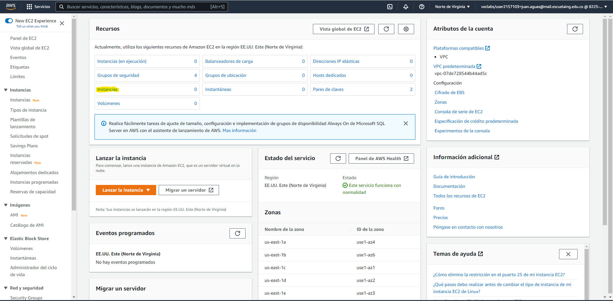
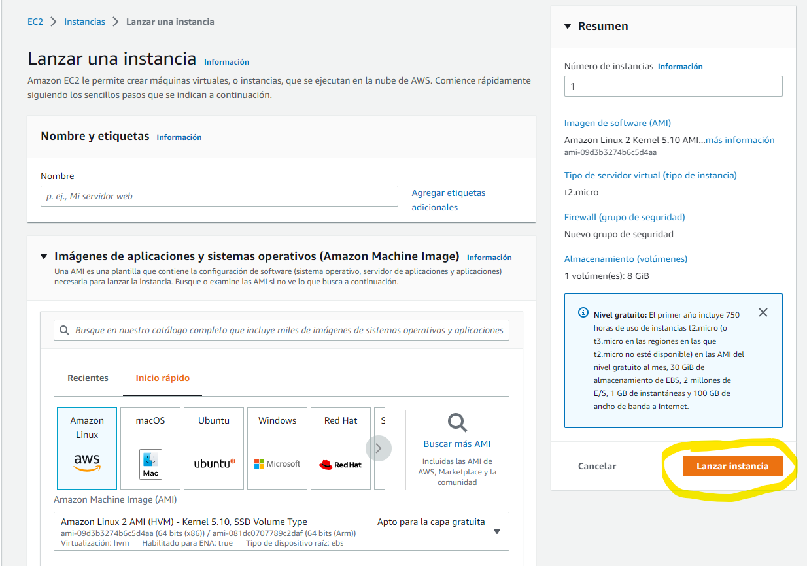
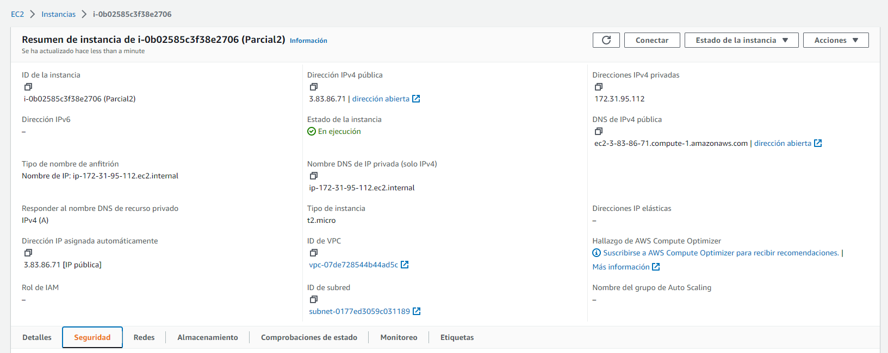
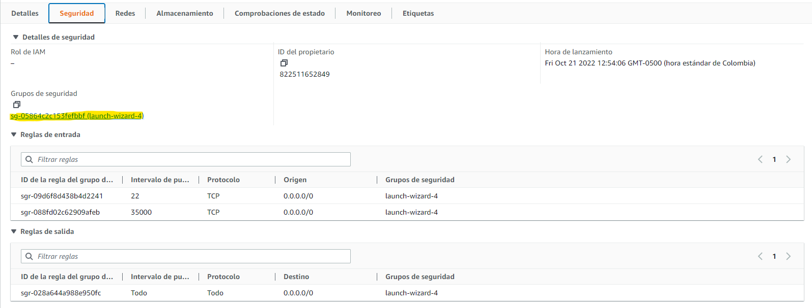
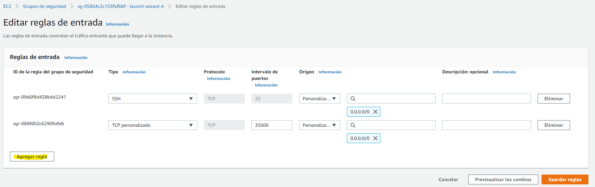
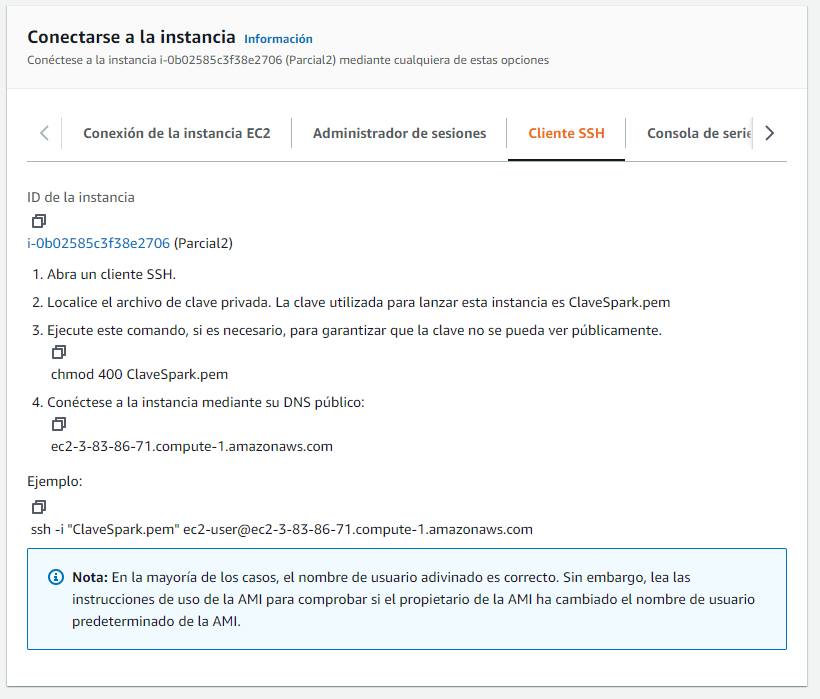

# Calculadora de Collatz en AWS

Este repositorio contiene una implementación de la conjetura de Collatz,
la cual puede ser accedida desde una página incluida en el servidor o se 
puede utilizar el siguiente endpoint para calcular la secuencia.

````url
    /collatzsequence?value=<valor>
````

## Ejecutandolo

---

### Como clonarlo
Para poder usar la calculadora es necesario clonar el repositorio para hacerlo
se debe cumplir con los siguientes requerimientos.

- [Git](https://git-scm.com/)
- [Java](https://www.java.com/es/)
- [Maven](https://maven.apache.org/download.cgi)

Por medio de este comando se puede clonar el repositorio

````url
    /collatzsequence?value=<valor>
````

### Como ejecutarlo

Una vez el repositorio fue clonado, el programa puede ser ejecutado con
los siguientes comandos.

````
    $ mvn clean install
    
    $ java -cp "target/classes;target/dependency/*" edu.escuela.SparkWebServer
````

Para poder usarlo se debe ingresar a:

````url
    http://localhost:35000/
````

---

## Docker

### Imagen en [DockerHub](https://hub.docker.com/)

Si se deseea usar el proyecto desde un contenedor de Docker la imagen ya esta creada y puede ser usada desde:

````url
    docker pull jfelipeag/collatz:latest
````


## Como desplegarlo en AWS

### Maquina Virtual en EC2

Para desplegar este proyecto en la nube, es necesaria la creación de una maquina virtual en AWS.
La cual debe ser creada desde el panel de EC2 por medio de la opción instancias.
Los parámetros deben de ser los que estan por defecto, luego se debe lanzar la instancia.





Una vez la instancia ya ha sido creada, se debe permitir el tráfico a esta desde internet por lo que se
modificaran las reglas de entrada a la instancia.



Una vez en el apartado de seguridad de la instancia, se entra al grupo de seguridad, en este se debe seleccionar
la opción de *Editar reglas de entrada*.




Al estar en la pantalla para modificar las reglas, se debe agregar una nueva regla y
hacerla visible para todo internet.



Finalmente, para conectarse a la maquina se deben seguir los paso que
brinda AWS para una conexión por un cliente ssh



### Funcionamiento con Docker

Una vez en la maquina virtual (esta debe tener Docker instalado) se puede correr
el proyecto corriendo la imagen que ya existe en DockerHub.

````docker
    docker run -d -p <puerto abierto>:6000 --name <nombre> jfelipeag/collatz:latest    
````

Teniendo esto, ya podremos usar la calculadora desde cualquier dispositivo conectado a Internet

El funcionamiento de la calculadora en AWS puede ser visto en el siguiente [video](https://youtu.be/SxpogbDV5GY)
ya que por temas de cosotos en la nube la instancia esta apagada.

---

Desarrollado por Juan Felipe Aguas Pulido - Escuela Colombiana De Ingeniería Julio Garavito